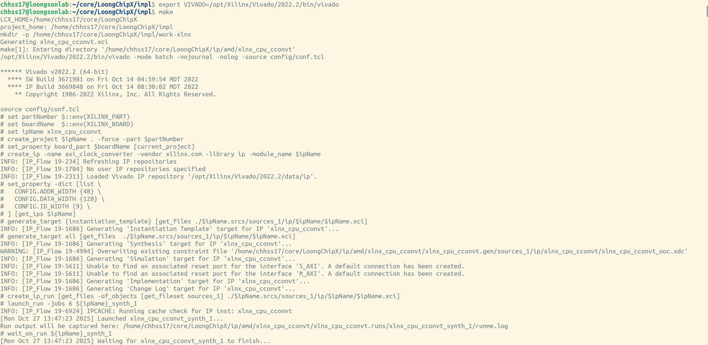

# FPGA实现

LoongChipX支持FPGA在部署运行。

## 软件安装

LoongChipX使用Vivado 2022.2版本作为运行平台。

请参考官方教程进行安装。

使用以下命令，设置环境变量。
``` shell
export VIVADO={/path/to/vivado}/bin/vivado
```

## FPGA运行

LoongChipX支持core连接多种外设，生成Soc，并在FPGA上实现，启动运行软件。

### 164核

以164核在龙芯试验箱上运行linux kernel 6.10为例。

请按照前序教程，准备交叉编译器，以及linux kernel源码等文件。

使用以下命令：
``` shell
cd {/path/to/LoongChipX}/impl
make		#	启动vivado并编译工程
make upload 	#	编译上板程序并烧录到fpga
```
部分运行过程显示如下。



在终端打开串口程序。
``` shell
sudo minicom -D /dev/ttyUSB0 	# tty端口请根据实机情况进行更改
```

可在终端串口程序中接受linux kernel启动信息。


### 364核

以364核在VCU118开发板上运行linux kernel 6.10为例子。

待补充。
