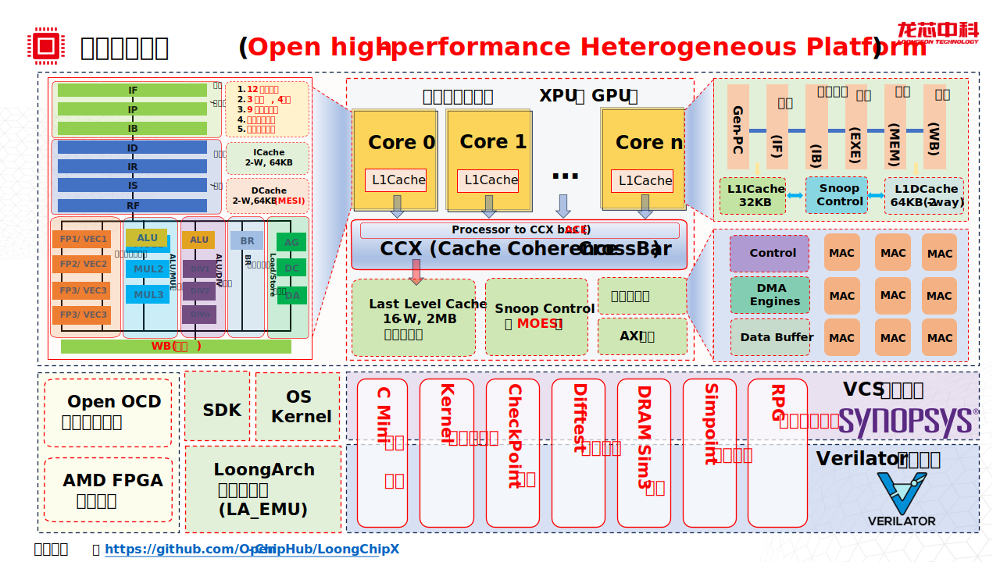

# LoongChipX用户手册
## 前言

LoongChipX是一个开源的异构多核处理器平台。包括多发射乱序高性能处理器LabCore364，五级流水的LabCore164，支持LoongArch32的小核LabCore132，包括后续开发中的六发射高性能处理器。我们旨在构建一个支持多核异构的处理器平台，提供仿真，验证的功能。包括相应的软件支持，如linux内核，gcc和llvm编译器等。

LoongChipX平台整体架构图如下所示。



## 项目简介

### 364

364是面向嵌入式系统和SoC应用领域的64为高性能处理器核，采用了LoongArch指令集。架构重点针对性能进行优化，实现 3 发射 8 执行的超标量架构等高性能技术。

### 164

164是面向嵌入式系统的64位超高能效处理器核，采用了LoongArch指令集。架构实现了五级弹发射顺序流水线技术，并针对功耗进行了专门的优化。

### 132

132是面向嵌入式系统的32为处理器核，采用了LoongArch32指令集，支持仿真验证和快速开发。

## 目录结构

工程目录结构如下。

```shell
LoongChipX
├── design
│   ├── common    （共用代码）
│   ├── soc        （顶层SoC例化文件）
│   └── sys
│       ├── ccx    （一致性协议）
│       ├── core    （CPU核心）
│       │   ├── lc164    （五级流水core，包含l1DCache和l1ICache,10万LOC）
│       │   └── lc364    （3发射core，包含l1DCache和l1ICache,30万LOC）
│       ├── filelists    （代码文件列表）
│       └── llc    （末级Cache）
├── impl    (FPGA例化脚本文件)
├── ip    (FPGA例化IP)
├── scripts    （常用脚本）
└── verif    （仿真验证）
    ├── common    （测试程序代码）
    ├── config    （测试样例配置文件）
    ├── ext    （测试样例程序）
    │   ├── loader    （样例加载程序）
    │   ├── simu-coremark-mmu    （加载页表的coremark样例程序）
    │   ├── simu-coremark-user    （coremark样例裸机程序）
    │   ├── simu-funcs    （函数测试程序）
    │   ├── simu-hello    （hello样例程序）
    │   ├── simu-hello-dual-core    （hello双核样例程序）
    │   ├── simu-hello-quad-core    （hello四核样例程序）
    │   └── simu-kernel    （内核样例程序）
    ├── filelists
    ├── vcs
    │   ├── CoreMark
    │   └── Hello
    └── verilator
        ├── VerSimApp
        ├── VerSimCKP
        └── VerSimKernel
```

## 快速上手

以下指令将帮助你编译并运行ChipX平台上的一个core仿真模型，并在fpga上实现。

### 开发环境

编译运行之前，请检查开发环境是否具备以下条件：
- Make版本为4.3及以上。
- 仿真工具支持Verilator 与 verdi。其中，verilator版本为5.008及以上。
- clang编译器版本为14.0.0及以上。
- 串口软件。如minicom，版本为2.8及以上。
- linux源码。内核版本6.10.可从Git仓库下载。
- 交叉编译器。版本为13.0.可从[build_Tools](https://github.com/loongson/build-tools/releases/)下载。
- fpga综合实现工具Vivado。版本为2022.2.


### 仿真运行

1、检查代码仓库并初始化所有模块
``` shell
git clone https://github.com/Open-ChipHub/LoongChipX.git
cd LoongChipX
git submodule update --init --recursive
```

2、编译测试用例。

ChipX支持的测试用例包括：
- hello：hello world程序。
- func：一些针对lsu，csr等模块的测试程序。
- coremark：性能基准测试程序。
- linux kernel：linux内核。

编译测试用例之前，需要配置交叉编译器相关环境变量。
``` shell
export CROSS_COMPILE=loongarch64-linux-gnu-gcc
export PATH=/path/of/your/cross_compile/bin:$PATH
```
其中，将`PATH`环境变量中，路径需要替换为本机交叉编译器所在目录。

进入到测试用例所在目录进行编译。以coremark程序为例。
``` shell
cd ext/simu-coremark-user
make
```

编译linux内核时，请执行以下指令
``` shell
make ARCH=loongarch CROSS_COMPILE=loongarch64-linux-gnu- menuconfig
make -j4
cp vmlinux $(LoongChipX_PATH)/verif/ext/simu-kernel/
```

3、编译与仿真
当使用Verilator进行仿真时，请根据如下命令进行：
``` shell
cd verif/verilator/VerSimApp
make CXX=clang
```
运行结果可在`verif/verilator/VerSimApp/logs/`目录下进行查看，包含串口打印，以及运行波形等。

如果需要仿真其他测试程序，可修改目录下`Makefile`文件。
``` shell
CONFIG  :=  $(VERIF_DIR)/config/config.test_banch_name
```

当使用vcs进行仿真时，请根据如下命令进行：
``` shell
cd verif/vcs/CoreMark
make
```
运行结果可在`verif/vcs/Coremark`目录下进行查看。


4、DiffTest仿真测试
DiffTest功能，为core在提交每一条指令时，与参考核进行对比，丰富调试手段。
为添加DittTest功能，需要进入每一个测试目录(如verif/verilator/VerRandom)下，在配置文件(如config/config.batch_random)中添加如下命令：
```shell
difftest=1
```
然后运行命令：
```shell
make
```
即可进行随机指令集测试。

5、随机指令仿真测试

为进行随机指令集测试，需要从地址下载随机测试数据集，并解压缩到scripts目录下。
进入verif/verilator/VerRandom目录下，在config/config.batch_random仿真配置文件中添加如下命令：

```shell
random_test=1
random_test_dir=../../../scripts/Random_Data/
```

然后运行命令：
```shell
make
```
即可进行随机指令集测试。


6，FPGA工程编译

我们验证的平台是AMD的[VCU118](https://china.xilinx.com/products/boards-and-kits/vcu118.html)，具体配置可访问官网。Vivado使用的是2022.2。
目前SOC平台支持最大的时钟频率为100MHz，可选择支持不同的时钟频率，可选的为50MHz, 20MHZ。
在项目主目录下，运行命令：

```shell
cd impl/
export VIVADO=/path/to/Vivado/2022.2/bin/vivado
make
```

运行完成后会在impl/work-xlnx目录下产生所需要的所有文件。
准备好Linux kernel和busybox的简易Rootfs,生成我们所需要的BIN文件，

```shell
make vmlinux
```

准备串口软件。在终端运行命令：

```shell
minicom -s
```

选择Serial port setup，在相应界面配置串口信息。

将FPGA与Vivado正确连接，上传生成的BIN文件到DDR，运行命令:

```shell
make upload 
```

按键复位后，可在串口软件接受到打印信息。

## 参考文献
1.[Xuantie-910: A Commercial Multi-Core 12-Stage Pipeline Out-of-Order 64-bit High Performance RISC-V Processor with Vector Extension](https://ftp.libre-soc.org/466100a052.pdf)

## 技术交流

## 开源许可

LoongChipX平台遵守木兰宽松许可证[Mulan PSL v2].
