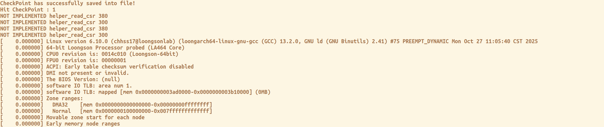
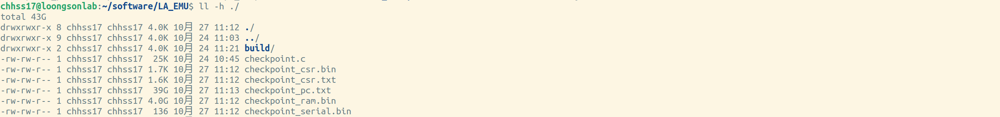
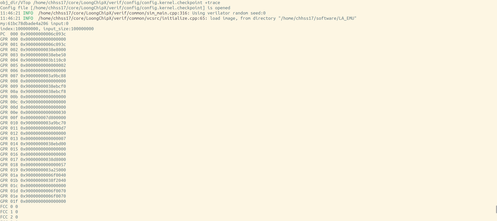

# 调试工具说明

`LoongChipX`提供了丰富的调试工具，致力于提升调试效率。

## LA_EMU仿真器

`LoongChipX`平台可使用`LA_EMU`仿真器，作为模型运行的参考标准。使用教程如下。

使用以下命令下载源码。
``` shell
git clone https://github.com/Open-ChipHub/LA_EMU.git
```
使用以下命令进行编译。
``` shell
cd ./LA_EMU
make
```
编译生成结果，可在当前路径下`build`文件夹里查看。

使用以下命令运行仿真器，以仿真运行linux内核为例子。
``` shell
# -m 指定仿真内存大小，可输入 -m 16
# -k 指定仿真程序，可输入 -k ~/linux/vmlinux
# 可使用./build/la_emu_kernel -h查看相关选项
./build/la_emu_kernel -w -z -n -m {MEMORY} -k {/path/to/linux}/vmlinux
```
可在终端得到仿真运行结果。


## 运行过程保存

LoongChipX可选择将模型运行过程中的状态，进行选择性保存。

使用以下命令：
``` shell
cd {/path/to/LoongChipX}/verif/common
vim sim_main.cpp
```
编译仿真程序主函数，进行如下修改。
``` c++
Top->debug_dump_on = 1;	// enable dump pc trace
#define WAVE_DUMP_BEGIN_PC 0x1d000000	#  dump_begin_pc
#define WAVE_DUMP_END_PC   0x1d000488	#  dump_end_pc
```
通过打开`debug_dump_on`开关，以及配置`WAVE_DUMP_BEGIN_PC`与`WAVE_DUMP_END_PC`作为运行过程的开始与结束`PC`值，完成配置。

继续使用以下命令，开始运行：
``` shell
# set VerSimAPP as instance.
cd {/path/to/LoongChipX}/verif/verilator/VerSimApp
make CXX=clang
```
模型在运行到`WAVE_DUMP_BEGIN_PC`时开始保存波形，在运行到`WAVE_DUMP_END_PC`时停止保存波形。

在当前目录下，可以看到`dbg.exe.report`，`dbg.exe.report.pc`两个文件。

`dbg.exe.report.pc`记录了模型运行的全部`PC`值，`dbg.exe.report`记录了每个`PC`值的提交周期。可与gold trace进行交叉对比，方便调试。


## Checkpoint功能

Checkpoint功能有助于系统的调试，优化运行流程。

首先，在LA_EMU中保存Checkpoint。

可使用以下命令运行：
```shell
cd ./LA_EMU
make
make ckp KERNEL_DIR={/path/to/linux/} CHECKPOINT_PC=####
```
其中，CHECKPOINT_PC即为期望保存现场的PC值。

LA_EMU运行时，如果运行到与CHECKPOINT_PC对应的现场，终端即会打印相关信息。




执行命令后，在LA_EMU目录下，即可获得Checkpoint相关文件。



进入到`{PATH_LoongChipX}/verif/config`目录中，进行以下操作。
``` shell
cd {/path/to/LoongChipX}/verif/config
vim config.kernel.checkpoint
```
编译checkpoint的对应配置文件如下。
``` shell
image_dir= {path_to_LA_EMU} 	#Checkpoint保存文件路径
kernel=../../../ext/simu-kernel/vmlinux # linux kernel路径
```
使用以下命令进行：
``` shell
cd {/path/to/LoongChipX}/verif/verilator/VerSimCKP
make CXX=clang
```
模型会加载Checkpoint文件中的regs，csr，mem等值，过程显示如下。




## Difftest功能

待补充。