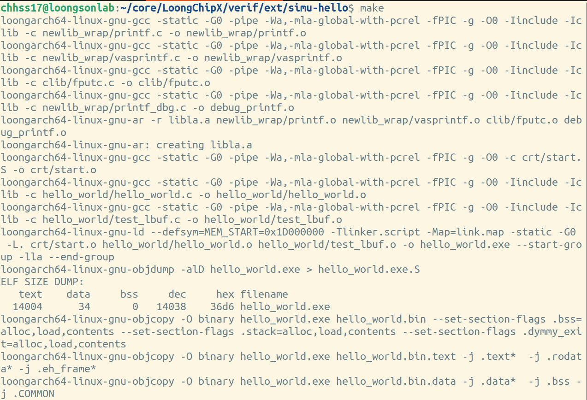
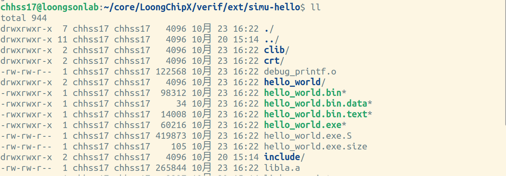
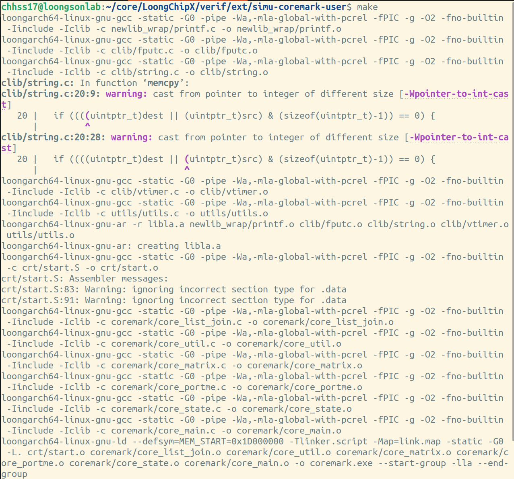
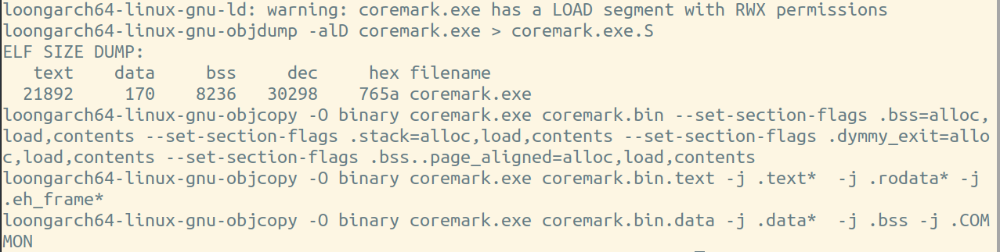
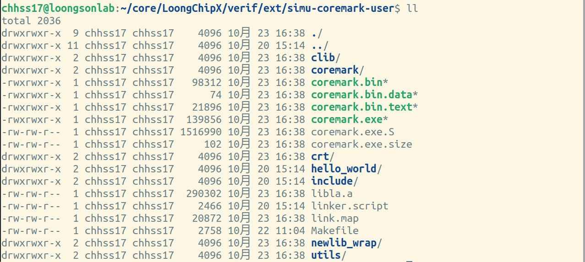
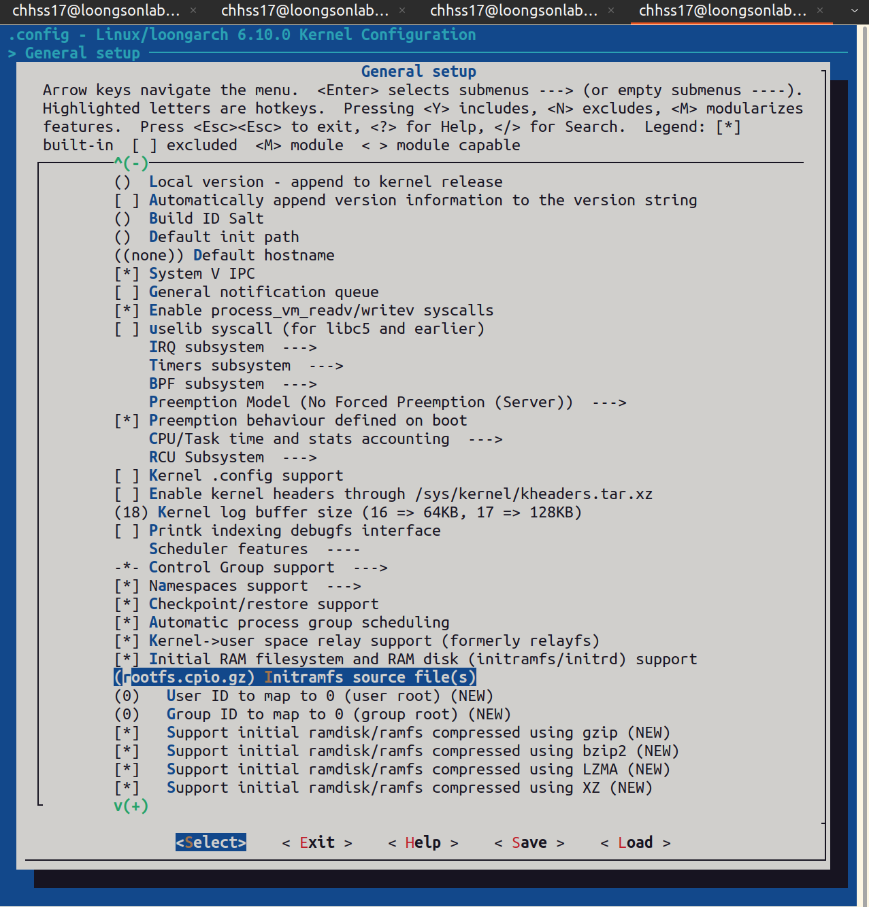
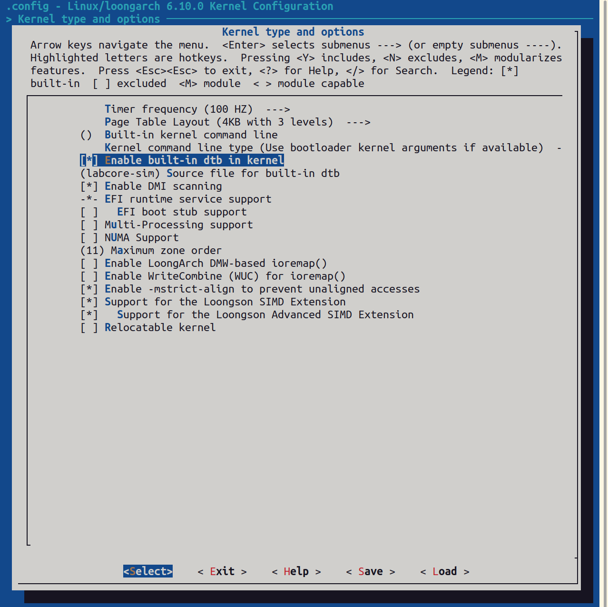
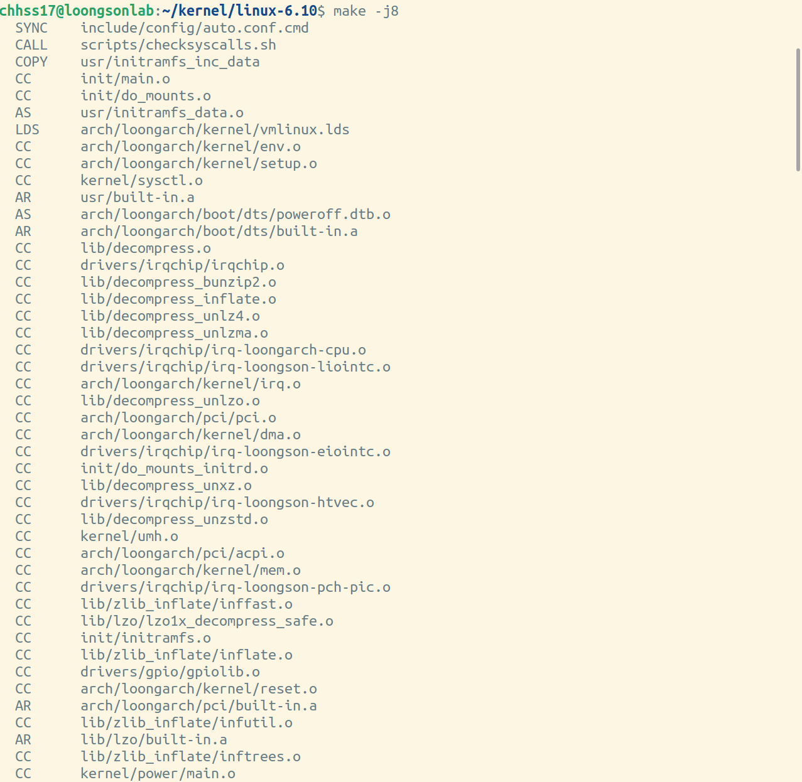
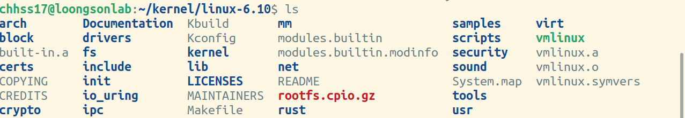

# 编译仿真环境配置

LoongChipX平台运行和测试环境均基于Ubuntu 22.04LTS版本进行。

首先检查代码仓库并初始化所有模块
``` shell
git clone https://github.com/Open-ChipHub/LoongChipX.git
cd LoongChipX
git submodule update --init --recursive
```

## 软件安装
编译仿真过程中需要的软件列表如下。
- Make.
- Clang.
- cross_compile.
- verilator/vcs.
- gtkwave.

1、make版本推荐4.3及以上。

使用以下命令检查软件安装情况。
``` shell
make -v
```
可使用以下命令进行安装。
``` shell
wget https://ftp.gnu.org/gnu/make/make-4.3.tar.gz
tar -zxvf make-4.3.tar.gz # 或更新版本
cd make-4.3
./configure --prefix=/usr/local/make-4.3
make
sudo make install
```

2、clang版本推荐14.0.0及以上。

使用以下命令检查软件安装情况。
``` shell
clang --version
```
可使用以下命令进行安装。
``` shell
sudo apt install clang-14
```

3、交叉编译器推荐13.0及以上。

使用以下命令检查软件安装情况。
``` shell
loongarch64-linux-gnu-gcc --version
```
可使用以下命令进行安装。
``` shell
wget https://github.com/loongson/build-tools/releases/download/2023.08.08/x86_64-cross-tools-loongarch64-gcc-libc.tar.xz
tar xvf ./x86_64-cross-tools-loongarch64-gcc-libc.tar.xz
# 配置编译器环境变量
export CROSS_COMPILE=loongarch64-linux-gnu-
export PATH=/path/of/cross/compile/bin:$PATH
```

4、verilator版本推荐5.008及以上。

使用以下命令检查软件安装情况。
``` shell
verilator --version
```
可使用以下命令进行安装。
``` shell
sudo apt install git help2man perl python3 autoconf g++ flex bison ccache
sudo apt install libgoogle-perftools-dev numactl perl-doc
sudo apt install libfl2 libfl-dev
sudo apt install zlibc zlib1g zlib1g-dev
# 将verilator源码下载到本地，可选择从仓库下载压缩包，或直接仓库克隆最新版本。
# 下载压缩包
wget https://github.com/verilator/verilator/archive/refs/tags/v5.008.tar.gz
# 克隆最新仓库
git clone https://github.com/verilator/verilator
# 开始安装
cd verilator
autoconf
./configure
make
sudo make install
```

VCS系统仿真器，请根据官方正版手册进行安装。

5、gtkwave版本推荐3.3及以上。

使用以下命令检查软件安装情况。
``` shell
gtkwave --version
```
可使用以下命令进行安装。
``` shell
sudo apt install gtkwave
```

## 测试用例编译
LoongChipX支持多个测试用例用于仿真，列表如下。
- hello world.
- coremark.
- linux kernel.

1、hello world程序编译

源码保存在`{PATH_LoongChipX}/verif/ext/simu-hello/`目录下。

使用以下命令进行编译。
``` shell
cd cd verif/ext/simu-hello
# 请确保交叉编译器环境变量设置正确
make
```
编译过程以及结果如下所示。




同时，我们提供双核，四核平台上的hello world测试程序。

位于`{PATH_LoongChipX}/verif/ext/simu-hello-dual-core/`目录下程序，支持双核平台测试。

位于`{PATH_LoongChipX}/verif/ext/simu-hello-quad-core/`目录下程序，支持四核平台测试。

编译命令与结果相同。

2、coremark程序编译

源码保存在`{PATH_LoongChipX}/verif/ext/simu-coremark-user/`目录下。

使用以下命令进行编译。
``` shell
cd cd verif/ext/simu-coremark-user
# 请确保交叉编译器环境变量设置正确
make
```
编译过程以及结果如下所示。





位于`{PATH_LoongChipX}/verif/ext/simu-coremark-mmu/`目录下程序，为带有虚实页表转换功能验证的coremark测试。

编译命令与结果相同。

3、linux kernel编译

linux内核版本推荐6.10。

首先，基于busybox制作最小根文件系统。

可使用以下命令获取busybox。
```shell
# 下载tar包
wget https://busybox.net/downloads/busybox-1.33.0.tar.bz2
tar -xjf ./busybox-1.33.0.tar.bz2
cd busybox-1.33.0
# 或从git仓库下载
git clone git://git.busybox.net/busybox
cd busybox
```
使用以下命令进行编译。
``` shell
# 安装依赖
sudo apt install libncurses5-dev ncurses-devel
make arch=loongarch CROSS_COMPILE=loongarch64-linux-gnu- defconfig
make arch=loongarch CROSS_COMPILE=loongarch64-linux-gnu- menuconfig
# 根据需求进行配置
make -j$(nproc)
# 生成到新建目录rootfs
make install CONFIG_PREFIX={/path/to/rootfs}
```
在rootfs目录下，进行以下命令。
``` shell
cd {/path/to/rootfs}
mkdir -p proc sys dev etc/init.d
vim etc/init.d/rcS
```
修改etc/init.d/rcS为以下内容
``` shell
mount -t proc none /proc
mount -t sysfs nont /sys
exec /bin/sh
```
进行以下命令。
``` shell
chmod +x etc/init.d/rcS
ln -sf bin/busybox init
# 打包为initramfs
find . | cpio -o -H newc | gzip > ../rootfs.cpio.gz
```

接下来编译linux kernel

可使用以下命令进行获取。
``` shell
# 下载tar.gz包
wget https://www.kernel.org/pub/linux/kernel/v6.x/linux-6.10.tar.gz
tar zxvf linux-6.10.tar.gz -C {/path/of/linux/}
cd linux-6.10
# 或从git仓库下载
git clone https://git.kernel.org/pub/scm/linux/kernel/git/torvalds/linux.git
cd linux
git checkout v6.10
```
使用以下命令，配置内核对应的设备数文件。
```shell
# 可手动从github仓库下载该文件，或使用以下命令
wget https://github.com/Open-ChipHub/LoongArch-SDK/blob/main/dts/labcore-sim.dts
mv ./labcore-sim.dts {/path/to/linux}/arch/loongarch/boot/dts/
```

使用以下命令，对linux kernel进行编译。
``` shell
cp {path/to/rootfs/}/rootfs.cpio.gz ./
# 请确保交叉编译器环境变量设置正确
make ARCH=loongarch CROSS_COMPILE=loongarch64-linux-gnu- menuconfig
```
在`[General setup]`选项中，选择`[Initial RAM filesystem and RAM disk (initramfs/initrd) support]`。在`[Initramfs source file(s)]`中输入`[rootfs.cpio.gz]`。



返回上一页，在`[Kernel type and options]`选项中，选中`[Enable built-in dtb in kernel]`，在`[Source file for built-in dtb]`中输入`[labcore-sim]`。



保存并退出。

使用以下命令，进行编译。
``` shell
# 请确保交叉编译器环境变量设置正确
make ARCH=loongarch CROSS_COMPILE=loongarch64-linux-gnu- -j$(nproc)
```
部分编译过程以及结果如下所示。



