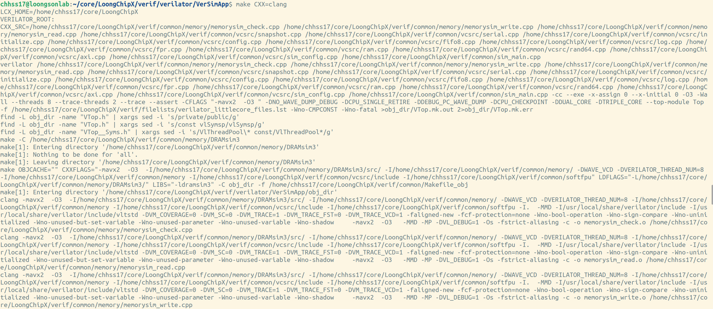
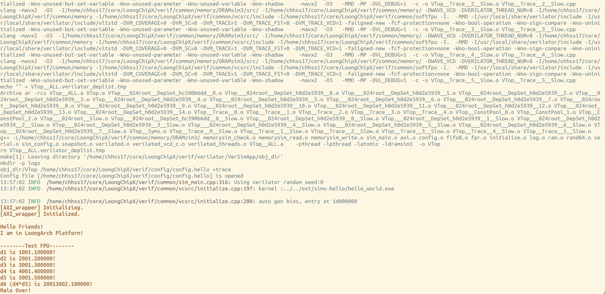
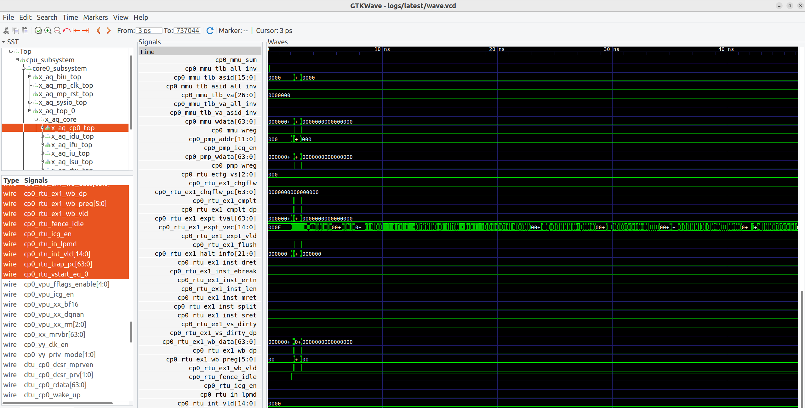
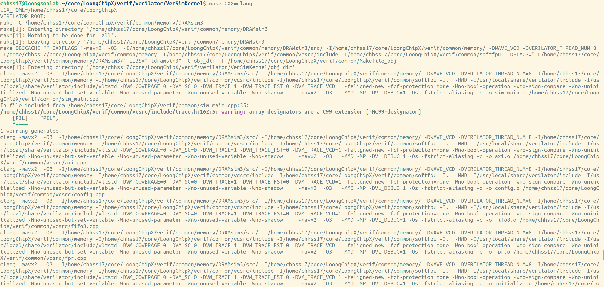
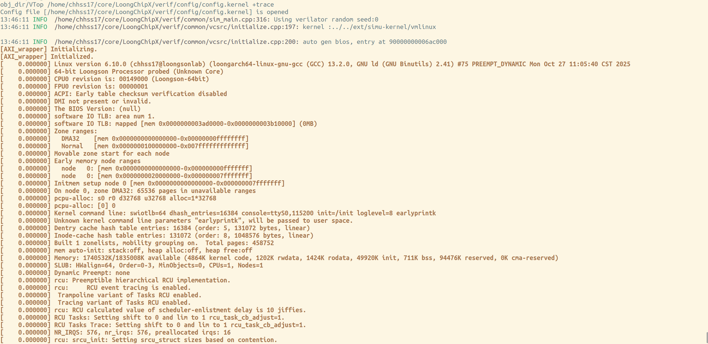
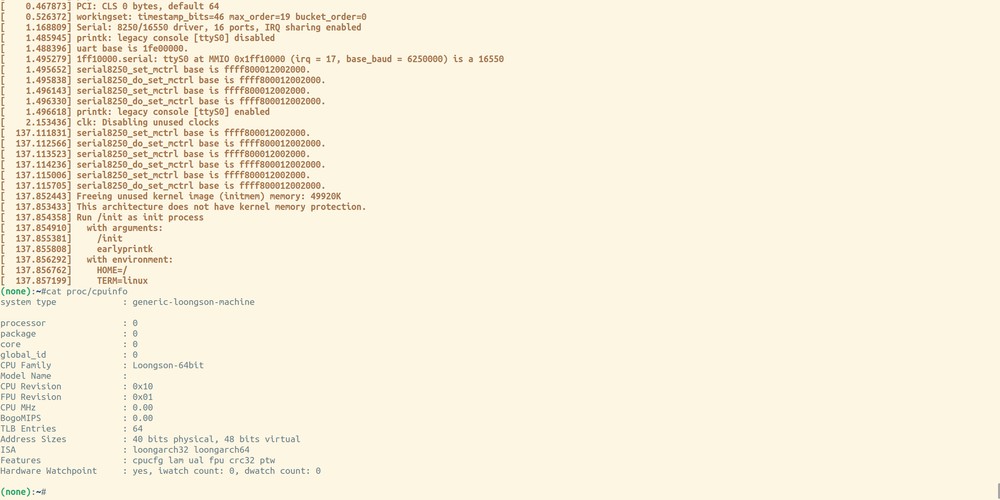
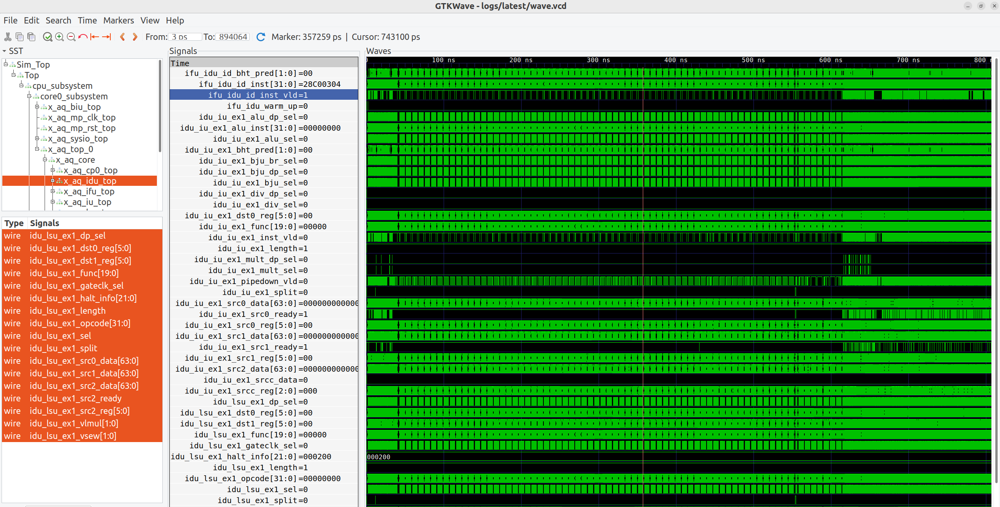

# 仿真运行说明

## 配置参数说明

为运行不同的测试程序，可在`{PATH_LoongChipX}/verif/config/`文件中，在测试程序对应的配置文件中，修改相应参数。其中，config配置文件具体参数与意义如下所示。

| 参数              | 范围             | 功能                                         |
| --------------- | -------------- | ------------------------------------------ |
| bios_mode       | 'auto'或二进制文件路径 | bios模式。'auto'为仿真环境自动生成bios，也可输入指定的bios文件路径 |
| kernel          | 二进制文件路径        | 测试集。输入指定的测试集二进制文件路径                        |
| log_dir         | 目录             | 仿真结果保存路径。                                  |
| log_level       | 'info','warn'等 | 调试信息打印分级 										|
| runtime_wave    | ‘0’或‘1’        | 是否保留仿真波形文件                                 |
| random_test     | ‘0’或‘1’        | 是否进行随机指令测试                                 |
| random_test_dir | 随机指令测试目录       | 随机指令测试文件路径                                 |
| difftest        | ‘0’或‘1’        | 是否进行DiffTest测试                             |
| with_serial     | '0'或'1'			| 是否支持串口设备打印 								|

## hello world程序仿真

### 测试程序配置

依据手册3.1.2章节，确保hello world测试程序已经编译完成并正确。

首先，使用以下命令配置合适的测试样例。
``` shell
cd verif/config
vim config.hello
```
该文件中，配置以下参数。
``` shell
#	默认参数配置
bios_mode=auto				# verilator sim主程序自动生成bios，用于加载测试程序
kernel=../../ext/simu-hello/hello_world.exe 	# 测试程序路径
wave_begin=0  	# 波形保存起始周期
#wave_end=3000
save_num=10 	# clean.py分析程序参数
log_level=info 	# 调试信息打印级别
log_dir=logs 	# 仿真结果保存路径
with_serial=1 	# 支持串口设备打印
```

### Verilator下仿真

如使用verilator进行仿真。

进入仿真程序对应目录。
``` shell
cd verif/verilator/VerSimApp
vim Makefile
```
修改Makefile。
``` shell
#	默认配置
include ../../common/verilator.mk
VERILATOR_DEFINE +=  	#	仿真宏定义
VERILATOR_SRC += 	# 	仿真程序源码
# VERILATOR_FILELISTS :=	#	core平台选择，默认使用164核
CONFIG  :=  $(VERIF_DIR)/config/config.hello 	# 配置文件选择
```
开始编译。
``` shell
make CXX=clang
```

编译过程以及运行过程如下所示。



在终端可查看运行过程中串口打印信息。



通过以下命令，查看波形图进行调试。
``` shell
gtkwave logs/latest/wave.vcd
```
显示如下。



### VCS下仿真

如使用VCS平台。

进入仿真程序对应目录。
``` shell
cd verif/vcs/Hello
vim Makefile
```
修改Makefile。
``` shell
#	默认配置
include ../../common/vcs.mk
CASE_NAME := simu-hello
CASE_BIN  := hello_world.bin
# big little hybrid
# HETE_ARCH := little
HETE_ARCH := big 		# 默认使用364核
# HETE_ARCH := hybrid
```
开始编译。
``` shell
make
```

## linux kernel仿真

### linux kernel配置
请依据手册3.1.2章节，确保linux kernel已经编译完成并正确。

首先，使用以下命令修改配置文件参数。
``` shell
cd verif/config
vim config.kernel
```
该文件中，配置以下参数。
``` shell
#	默认参数配置
bios_mode=auto				# verilator sim主程序自动生成bios，用于加载测试程序
kernel=../../../ext/simu-kernel/vmlinux 	# linux kernel路径
log_level=info 	# 调试信息打印级别
log_dir=logs 	# 仿真结果保存路径
with_serial=1 	# 支持串口设备打印
```

### Verilator下仿真

如使用verilator进行仿真。

进入仿真程序对应目录。
``` shell
cd verif/verilator/VerSimKernel
vim Makefile
```
修改Makefile。
``` shell
#	默认配置
include ../../common/verilator.mk
VERILATOR_DEFINE +=  	#	仿真宏定义
VERILATOR_SRC += 	# 	仿真程序源码
# VERILATOR_FILELISTS :=	#	core平台选择，默认使用164核
CONFIG  :=  $(VERIF_DIR)/config/config.kernel 	# 配置文件选择
```
开始编译。
``` shell
make CXX=clang
```

编译过程以及运行过程如下所示。




在终端可查看运行过程中串口打印信息，显示如下。



通过以下命令，查看波形图进行调试。
``` shell
gtkwave logs/latest/wave.vcd
```
显示如下。



由于linux kernel内核仿真波形较大，不推荐在vcs上仿真。

## 通用仿真流程

如果选择不同大小的core，或者多核平台，针对其他程序进行测试，需要进行如下修改。

1、修改测试程序配置文件为`config.testbench`，明确以下参数。
```shell
bios_mode=auto				# bios模式
kernel={path/to/testbench} 	# 测试程序路径
log_dir=logs 	# 仿真结果保存路径
with_serial=1 	# 支持串口设备打印
```
2、修改`verif/{verilator/vcs}}/VerSim/Makefile`文件。
```shell
VERILATOR_FILELISTS :=	{platform/to/choose}#	core平台选择.
CONFIG  :=  $(VERIF_DIR)/config/config.testbench 	# 配置文件选择
```
其中，core平台选择，可在`{PATH_LoongChipX}/verif/filelists`下进行选择。

Verilator平台下可选择`verilator_littlecore_files.lst`，表明仿真平台为164核，或`verilator_bigcore_files.lst`，表明仿真平台为364核。

VCS平台下可选择`vcs_bigcore_files.lst`，表示仿真平台为364核，或`vcs_littlecore_files.lst`，表明仿真平台wield164核，或`vcs_hybrid_files.lst`，表明仿真平台为164与364组成的异构平台。