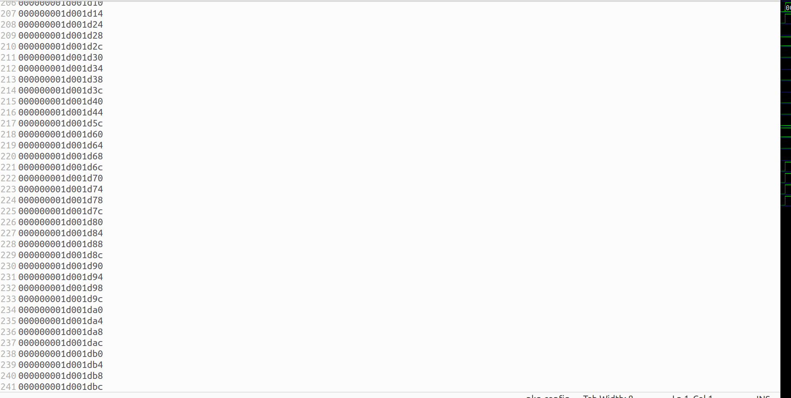
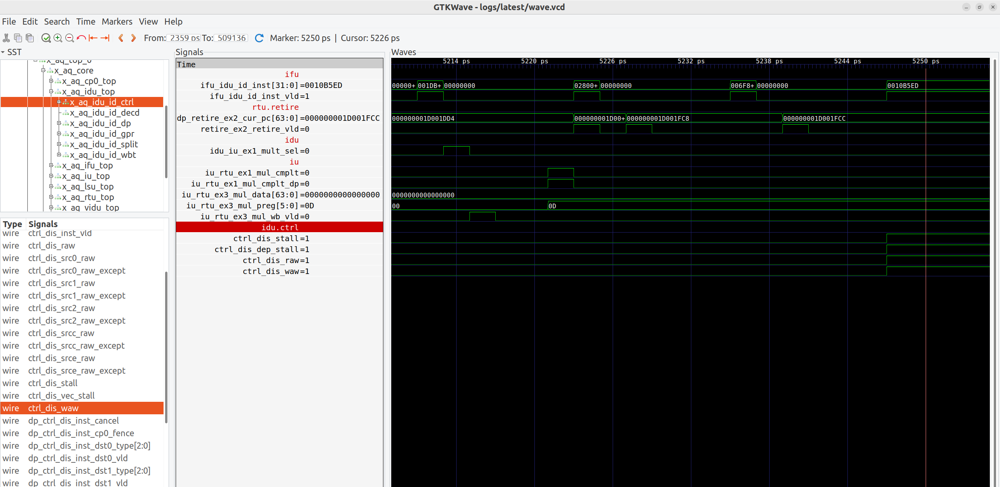

# 调试教程

为方便使用，展示调试工具的简单使用流程。

请按照前叙教程，在164核上运行coremark，在终端可正常获得coremark运行打印信息。

现在，暂时修改`design/sys/core/lc164/iu/rtl/aq_iu_mul.v`文件第437行，为如下。
``` VHDL
assign iu_rtu_ex3_mul_wb_vld = mult_ex1_inst_vld;
```

再次运行程序，发现模型持续运行，却无任何打印信息，可知模型出现问题，需要进行调试。

调试过程可遵循以下流程。

1、获取运行现场

我们需要打开dump pc，来获取模型运行过程中的详细信息。请参考前面章节，获取`WAVE_DUMP_BEGIN_PC`与`WAVE_DUMP_END_PC`两个文件。

2、分析现场文件

获得两个文件后，我们需要进行分析。

一般来说，我们可以寻找正确的运行过程，即gold trace，进行交叉对比。gold trace可来源于`LA_EMU` user状态下的运行保存，也可来源于正确模型的运行状态。我们可使用正确的164核运行结果`WAVE_DUMP_BEGIN_PC`，进行交叉对比，可得`PC`值运行异常的指令位置。

本次实验中，`WAVE_DUMP_END_PC`只保留有241行后，就不再增长。



说明模型运行过程中，在该指令附近，存在指令卡死的情况。

3、保存波形文件。

获取到卡死指令附近`PC`值时，我们可在`verif/common/sim_main.cpp`中，设置以下变量。
``` c++
#define WAVE_DUMP_BEGIN_PC 0x-------- # 卡死指令`PC`值前数条指令
#define WAVE_DUMP_END_PC   0x--------
```
并运行，可获得问题现场的波形文件。

查看波形文件。



可发现，是`1d001fc4`处的乘法指令，并没有将计算结果写回到目的寄存器，导致`idu`译码模块触发寄存器写后读`raw`与写后写`waw`两种异常，导致流水线进入停滞`stall`状态。

即正确定位到问题在于`mul`模块没有写回，完成调试。